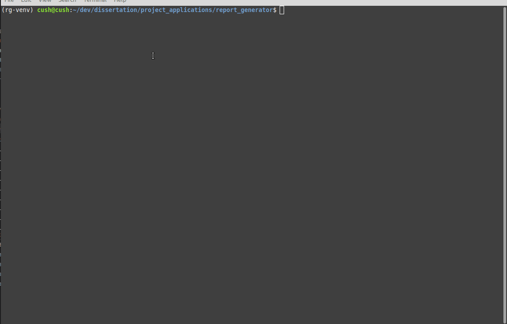
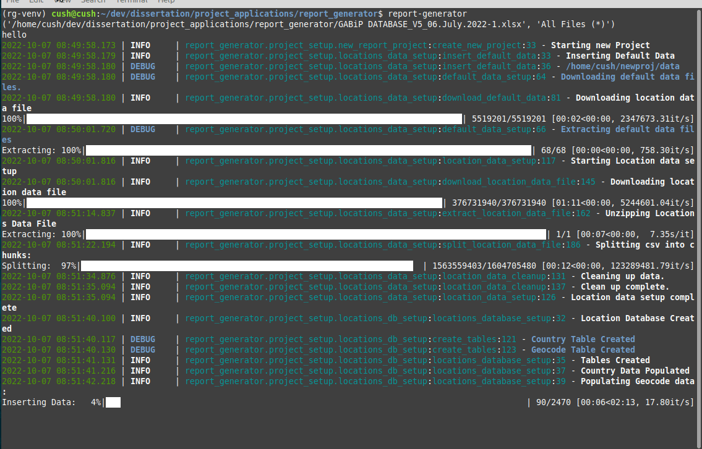
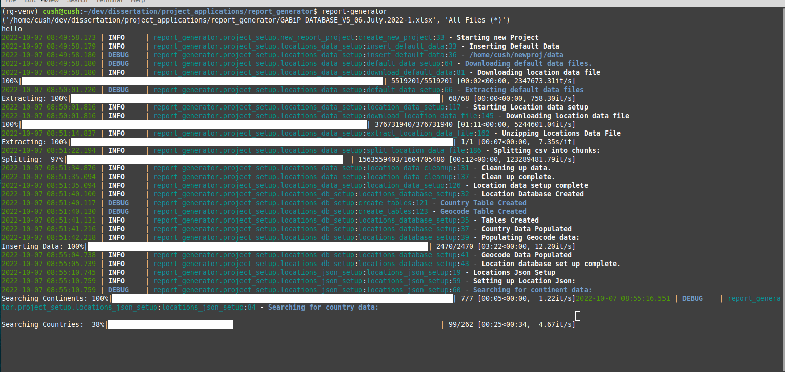
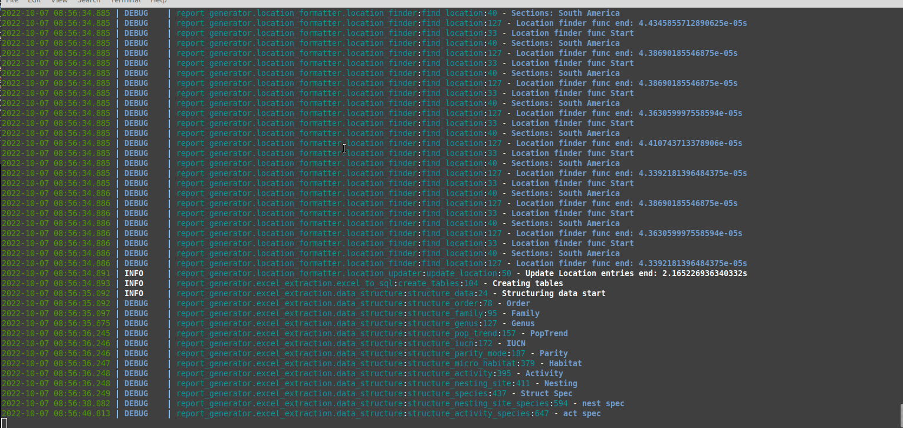
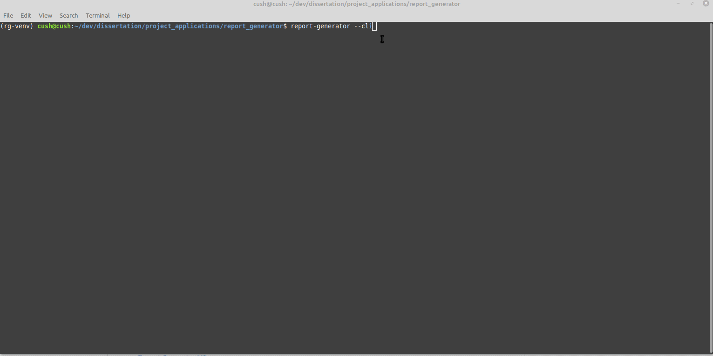
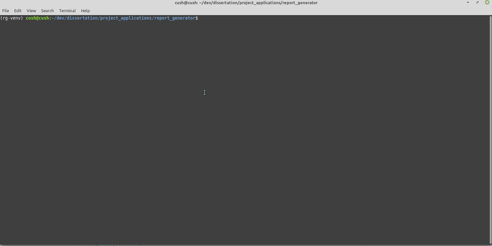
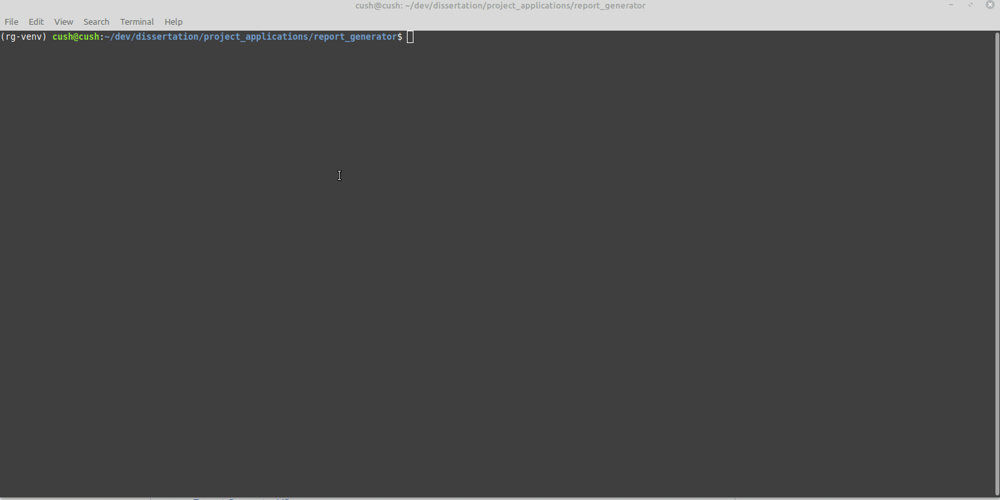

# REPORT GENERATOR

## Requirements

Python3 is required to be installed on the computer. Also, the python3 Venv package is required to be installed.

If Python3 is not available program can be ran by downloading executable files found in zipped in the dist_zip directory.

Further project requirements for external Python libraries can be found in the requirements.txt file. This file is located in the root folder of the project directory.

The rest of the process of the project's setup is outlined in the installation section below.

## Installation

### Installation from PyPI

To install from PyPI and using pip it is recommended to initially set up a virtual environment or use a package manager like poetry.

        python3 -m venv {venv-name}

Then activate the venv.

        source {venv-name}/bin/activate

Then install the package.

        pip install qub-amphibian-report-generator

## Use

### GUI

Once the package has been installed and setup the Report Generator program can be used from venv with the command:

        report-generator

This will start the GUI application for the report generator. If the report-generator command has not been run before it will begin the project setup process.

#### Project Setup

The user will need to enter some project settings information:

The process will download relevant data files and create and insert data into project databases:

#### Create Report

This will then allow the user to run the report generator again and produce the outputted pdf file.

### CLI

If the user wants to use the CLI:

        report-generator --cli [options]

#### CLI default report

#### CLI filtered report

#### CLI options

CLI options can be found with the command:

        report-generator -h
        report-generator -help

Or can be found in the projects documentation.

If the user wants to set up a new project:

        create-report-generator

## Documentation

Project documentation can be found [here](https://ccushnahan.github.io/report_generator/)

## Versions

Archived versions of the Report Generator Program can be found in links to repositories below
- [Report Generator V1](https://gitlab2.eeecs.qub.ac.uk/13067079/report_generator_v1)
- [Report Generator V2](https://gitlab2.eeecs.qub.ac.uk/13067079/report-generator-v2)

## Changelog

